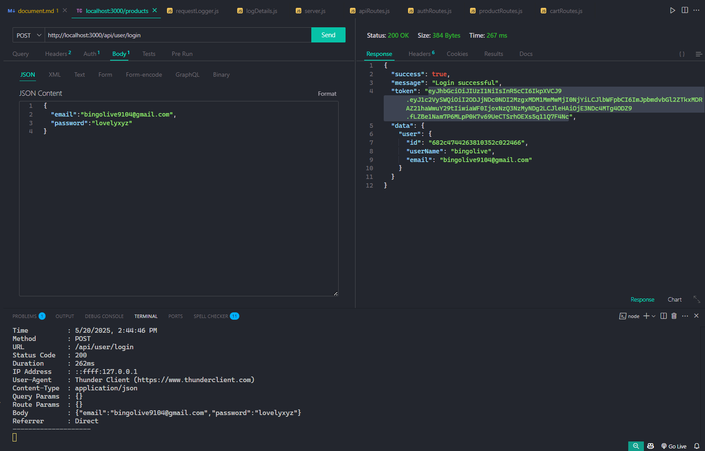

# ✅ Test Results of Backend API

---

## 📦 1. GET Requests on Products

### ➤ All Products

- **Scenario:** API URL is `http://localhost:portNumber/api/products`.
- **Expected:** Should fetch all products without requiring a token.
- **Actual:** Products fetched successfully.
- **HTTP Status:** 200 OK  
- 

### ➤ Single Product by ID

- **Scenario:** API URL is `http://localhost:portNumber/api/products/{id}`.
- **Expected:** Should fetch the product with the given ID.
- **Actual:** Product details returned.
- **HTTP Status:** 200 OK  
- 

---

## 👤 2. User Registration and Login

### ➤ User Signup

- **Scenario:** API URL is `http://localhost:portNumber/api/user/signup`.
- **Expected:** Should register a new user.
- **Actual:** User registered and saved in DB.
- **HTTP Status:** 201 Created  
-   
- 

### ➤ User Login

- **Scenario:** API URL is `http://localhost:portNumber/api/user/login`.
- **Expected:** Should log in and return a JWT token.
- **Actual:** Logged in and token received.
- **HTTP Status:** 200 OK  

- ```text
  token : eyJhbGciOiJIUzI1NiIsInR5cCI6IkpXVCJ9...
  ```

- 

---

## 🛒 3. POST Request on Cart

### ➤ Without Token

- **Scenario:** API URL is `http://localhost:portNumber/api/cart/{productId}` without access token.
- **Expected:** Should return unauthorized error.
- **Actual:** Access denied.
- **HTTP Status:** 401 Unauthorized  
- 

### ➤ With Token

- **Scenario:** API URL is `http://localhost:portNumber/api/cart/{productId}` with access token.
- **Expected:** Product should be added to cart.
- **Actual:** Product added successfully.
- **HTTP Status:** 200 OK  
-   
- 

---

## 🔄 4. PUT Request on Cart

- **Scenario:** API URL is `http://localhost:portNumber/api/cart/{productId}` with token.
- **Expected:** Should update cart item.
- **Actual:** Cart updated successfully.
- **HTTP Status:** 200 OK  
-   
- 

---

## ❌ 5. DELETE Request on Cart

- **Scenario:** API URL is `http://localhost:portNumber/api/cart/{productId}` with token.
- **Expected:** Should delete item from cart.
- **Actual:** Cart item deleted.
- **HTTP Status:** 200 OK  
-   
- 
